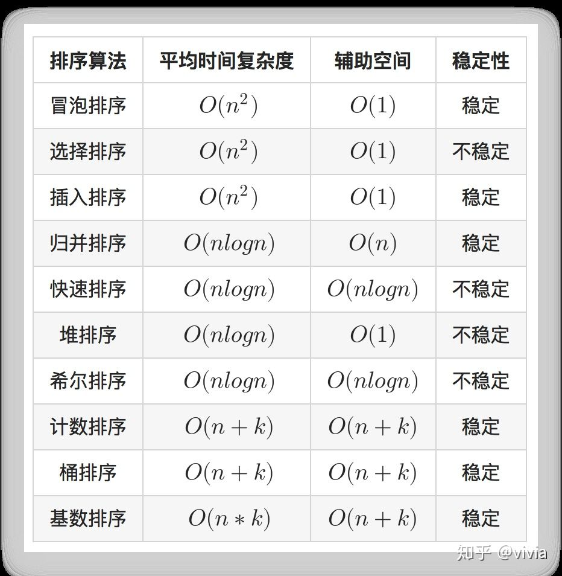

### 排序: 代码见 Sorts 目录
-

### 布隆过滤器:
- 一个很长的二进制向量(位数组)
- 一系列随机函数(哈希)
- 空间效率和查询效率很高
- 有一定的误判率
#### 向布隆过滤器添加元素
- 1.将要添加的元素给k个哈希函数
- 2.得到对应于位数组上的k个位置
- 3.将这些位置置为1
#### 布隆过滤器查询元素
- 1.将要查询的元素给k个哈希函数
- 2.得到对应于位数组上的k个位置
- 3.如果有一个位置上的值为0，则说明一定不存在
- 4.如果k个位置上的值都为1，则说明可能存在

### 字符串匹配
- [Boyer-Moore算法](https://www.ruanyifeng.com/blog/2013/05/boyer-moore_string_search_algorithm.html)
- [KMP算法](http://www.ruanyifeng.com/blog/2013/05/Knuth%E2%80%93Morris%E2%80%93Pratt_algorithm.html)
- [Rabin-Karp算法](https://www.jianshu.com/p/24895aca0459)
- [KMP、BoyerMoore、Sunday算法](https://blog.csdn.net/u012505432/article/details/52210975)

